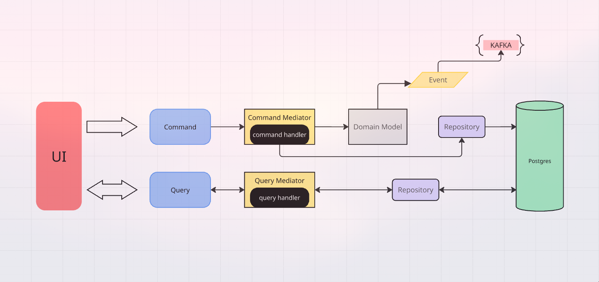
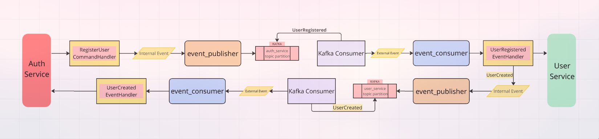
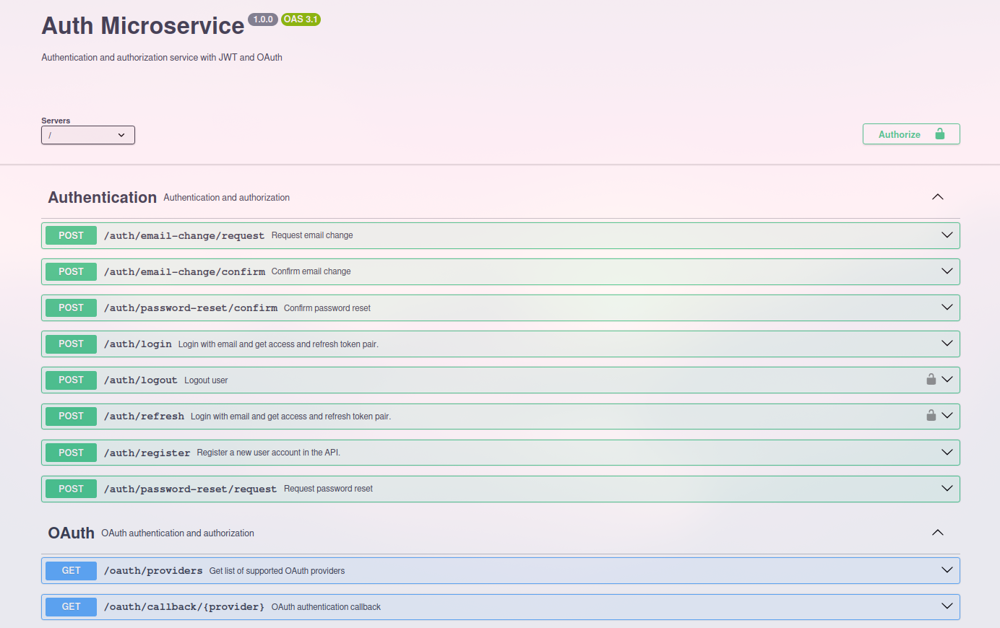
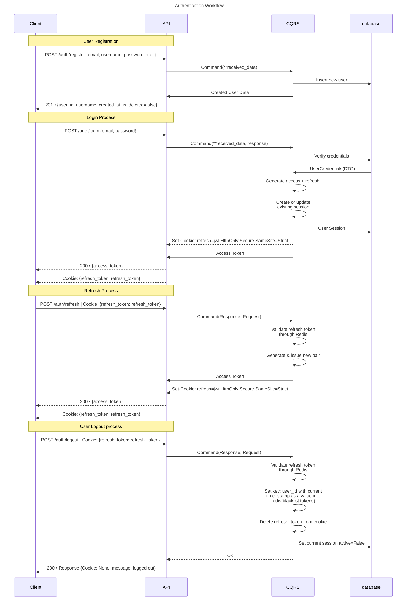
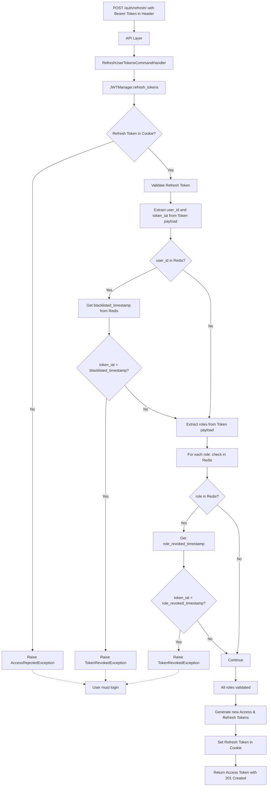

## Dependencies

#### Presentation:
- [Litestar](https://litestar.dev/)

#### Infrastructure:
- [Postgres](https://www.postgresql.org/docs/current/index.html)
- [Redis](https://redis.io/)
- [Kafka](https://kafka.apache.org/)

#### Observation:
- [Prometheus](https://prometheus.io/)
- [Alloy](https://github.com/alloy/alloy)
- [Grafana](https://grafana.com/)
- [Loki](https://grafana.com/loki/)

#### Python Libs:
- [Pydantic](https://pydantic-docs.helpmanual.io/)
- [SQLAlchemy](https://www.sqlalchemy.org/)
- [Alembic](https://alembic.sqlalchemy.org/en/latest/)
- [Celery](https://docs.celeryq.dev/en/stable/)
- [dishka](https://dishka.readthedocs.io/en/latest/)
- [aiokafka](https://aiokafka.readthedocs.io/en/stable/)
- [structlog](https://www.structlog.org/en/stable/)

#### Deployment:
- [Docker](https://www.docker.com/)
- [Docker Compose](https://docs.docker.com/compose/)

#### Formatting/Linting:
- [black](https://black.readthedocs.io/en/stable/)
- [ruff](https://beta.ruff.rs/docs/rules/)
- [mypy](https://mypy.readthedocs.io/en/stable/)

#### Project Manager:
- [uv](https://docs.astral.sh/uv/)

## Running the Application

This project is containerized with Docker for easy setup and deployment. Follow these steps to get started:

### Requirements:

- Docker and Docker Compose installed on your system
- Git (to clone the repository)

### Setup: 
1. Clone the repository:
```bach
git clone https://github.com/VinoStudio/auth_service.git
cd [repo-directory]
```
2. Configure environment variables

```bash
cp .env.example .env
```
Edit the .env file with your preferred settings

### Starting and Stopping the Application
The application uses a Docker Compose setup with multiple services:
1. Run the application:
```bash
make app
```

2. Run observation (grafana, alloy, loki, prometheus):
```bash
make start_logs
```

3. Stop application running containers by:
```bash
make down
```

4. Stop observation:
```bash
make stop-logs
```

### Accessing Services

Once running, you can access:
- Auth Service API: http://localhost:8002/docs
- PgAdmin: http://localhost:5437

You can change API port by editing the .env file
To change PgAdmin, Postgres ports, edit the docker-compose.yaml

### Troubleshooting
If you encounter issues:
```bash
#View application logs in you terminal window:
make logs

#Access the application container:
make app-exec
```


## Architectural Overview

The directory structure is based on [Onion Architecture](https://jeffreypalermo.com/2008/07/the-onion-architecture-part-1/).

``` project tree
├── src
│   ├── infrastructure
│   │   ├── base
│   │   │   ├── repository
│   │   │   │   ├── role_repo.py
│   │   │   │   ├── permission_repo.py
│   │   │   │   ├── base.py
│   │   │   │   ├── user_reader.py
│   │   │   │   ├── session_repo.py
│   │   │   │   └── user_writer.py
│   │   │   ├── exception.py
│   │   │   ├── message_broker
│   │   │   │   ├── base.py
│   │   │   │   ├── consumer.py
│   │   │   │   └── producer.py
│   │   │   └── uow.py
│   │   ├── message_broker
│   │   │   ├── kafka_producer.py
│   │   │   ├── kafka_consumer.py
│   │   │   ├── events
│   │   │   │   ├── external
│   │   │   │   │   ├── user_created.py
│   │   │   │   │   └── base.py
│   │   │   │   └── internal
│   │   │   │       ├── base.py
│   │   │   │       └── user_registered.py
│   │   │   ├── message_broker_di_setup.py
│   │   │   ├── consumer_manager.py
│   │   │   ├── exceptions.py
│   │   │   └── converters.py
│   │   ├── exceptions
│   │   │   ├── database.py
│   │   │   ├── message_broker.py
│   │   │   └── repository.py
│   │   ├── log
│   │   │   ├── event_handler.py
│   │   │   ├── processors.py
│   │   │   └── main.py
│   │   ├── repositories
│   │   │   ├── oauth
│   │   │   │   └── oauth_repo.py
│   │   │   ├── pagination.py
│   │   │   ├── permission
│   │   │   │   └── permission_repo.py
│   │   │   ├── token
│   │   │   │   └── redis_repo.py
│   │   │   ├── session
│   │   │   │   └── session_repo.py
│   │   │   ├── user
│   │   │   │   ├── user_reader.py
│   │   │   │   └── user_writer.py
│   │   │   ├── helpers.py
│   │   │   ├── role
│   │   │   │   ├── role_repo.py
│   │   │   │   └── role_invalidation_repo.py
│   │   │   ├── repo_di_setup.py
│   │   │   └── converters.py
│   │   └── db
│   │       ├── migrations
│   │       │   ├── script.py.mako
│   │       │   ├── env.py
│   │       │   ├── README
│   │       │   └── versions
│   │       ├── setup.py
│   │       ├── uow.py
│   │       ├── models
│   │       │   ├── base.py
│   │       │   ├── mixins.py
│   │       │   ├── oauth_provider.py
│   │       │   ├── user.py
│   │       │   ├── role.py
│   │       │   ├── permission.py
│   │       │   └── session.py
│   │       └── database_di_setup.py
│   ├── presentation
│   │   └── api
│   │       ├── exception_configuration.py
│   │       ├── kafka_setup.py
│   │       ├── lifespan.py
│   │       ├── base_role_permissions_setup.py
│   │       ├── v1
│   │       │   ├── base_responses.py
│   │       │   ├── auth
│   │       │   │   ├── response
│   │       │   │   │   ├── token.py
│   │       │   │   │   └── user.py
│   │       │   │   ├── auth_router.py
│   │       │   │   ├── utils.py
│   │       │   │   ├── request
│   │       │   │   │   ├── token.py
│   │       │   │   │   └── user.py
│   │       │   │   └── oauth_router.py
│   │       │   ├── users
│   │       │   │   ├── user_router.py
│   │       │   │   ├── response
│   │       │   │   │   └── user.py
│   │       │   │   └── request
│   │       │   │       └── user.py
│   │       │   └── roles
│   │       │       ├── rbac_router.py
│   │       │       ├── response
│   │       │       │   ├── role.py
│   │       │       │   └── permission.py
│   │       │       └── request
│   │       │           ├── role.py
│   │       │           └── permission.py
│   │       └── main.py
│   ├── application
│   │   ├── dto
│   │   │   ├── token.py
│   │   │   ├── user.py
│   │   │   ├── role.py
│   │   │   ├── permission.py
│   │   │   └── session.py
│   │   ├── base
│   │   │   ├── dto
│   │   │   │   └── dto.py
│   │   │   ├── interface
│   │   │   │   ├── request.py
│   │   │   │   └── response.py
│   │   │   ├── security
│   │   │   │   ├── jwt_user.py
│   │   │   │   ├── cookie_manager.py
│   │   │   │   ├── jwt_encoder.py
│   │   │   │   ├── jwt_manager.py
│   │   │   │   └── jwt_payload.py
│   │   │   ├── events
│   │   │   │   ├── external_event_handler.py
│   │   │   │   └── event_handler.py
│   │   │   ├── event_sourcing
│   │   │   │   ├── event_publisher.py
│   │   │   │   └── event_consumer.py
│   │   │   ├── session
│   │   │   │   └── session_manager.py
│   │   │   ├── exception.py
│   │   │   ├── queries
│   │   │   │   ├── base.py
│   │   │   │   └── query_handler.py
│   │   │   ├── commands
│   │   │   │   ├── base.py
│   │   │   │   └── command_handler.py
│   │   │   ├── mediator
│   │   │   │   ├── query.py
│   │   │   │   └── command.py
│   │   │   └── rbac
│   │   │       └── base.py
│   │   ├── services
│   │   │   ├── security
│   │   │   │   ├── token_type.py
│   │   │   │   ├── jwt_payload_generator.py
│   │   │   │   ├── jwt_di_setup.py
│   │   │   │   ├── cookie_manager.py
│   │   │   │   ├── jwt_encoder.py
│   │   │   │   ├── security_user.py
│   │   │   │   ├── jwt_manager.py
│   │   │   │   └── oauth_manager.py
│   │   │   ├── tasks
│   │   │   │   ├── email_templates.py
│   │   │   │   ├── task_di_setup.py
│   │   │   │   ├── notification_manager.py
│   │   │   │   └── celery.py
│   │   │   ├── session
│   │   │   │   ├── session_di_setup.py
│   │   │   │   ├── session_manager.py
│   │   │   │   └── device_identifier.py
│   │   │   └── rbac
│   │   │       ├── rbac_di_setup.py
│   │   │       ├── rbac_manager.py
│   │   │       └── helpers.py
│   │   ├── cqrs
│   │   │   ├── permission
│   │   │   │   ├── events
│   │   │   │   ├── permission_di_setup.py
│   │   │   │   ├── queries
│   │   │   │   │   └── get_all_permissions.py
│   │   │   │   └── commands
│   │   │   │       ├── delete_permission.py
│   │   │   │       └── create_permission.py
│   │   │   ├── user
│   │   │   │   ├── user_di_setup.py
│   │   │   │   ├── events
│   │   │   │   │   ├── external
│   │   │   │   │   │   └── user_created.py
│   │   │   │   │   └── internal
│   │   │   │   │       └── user_registered.py
│   │   │   │   ├── queries
│   │   │   │   │   ├── get_current_user_session.py
│   │   │   │   │   ├── get_all_user_sessions.py
│   │   │   │   │   ├── get_user_permissions.py
│   │   │   │   │   ├── get_users.py
│   │   │   │   │   ├── get_current_user_permissions.py
│   │   │   │   │   ├── get_user_by_id.py
│   │   │   │   │   ├── get_current_user_oauth_accounts.py
│   │   │   │   │   ├── get_current_user.py
│   │   │   │   │   ├── get_user_by_username.py
│   │   │   │   │   ├── get_current_user_roles.py
│   │   │   │   │   └── get_user_roles.py
│   │   │   │   └── commands
│   │   │   │       ├── reset_user_password_request.py
│   │   │   │       ├── oauth_login_user.py
│   │   │   │       ├── logout_user.py
│   │   │   │       ├── change_email_request.py
│   │   │   │       ├── login_user.py
│   │   │   │       ├── register_user.py
│   │   │   │       ├── add_oauth_account_to_current_user.py
│   │   │   │       ├── refresh_user_tokens.py
│   │   │   │       ├── change_user_email.py
│   │   │   │       ├── reset_user_password.py
│   │   │   │       ├── register_oauth_user.py
│   │   │   │       ├── deactivate_oauth_account.py
│   │   │   │       └── add_oauth_account_request.py
│   │   │   ├── helpers.py
│   │   │   ├── role
│   │   │   │   ├── events
│   │   │   │   ├── role_di_setup.py
│   │   │   │   ├── queries
│   │   │   │   │   └── get_all_roles.py
│   │   │   │   └── commands
│   │   │   │       ├── assign_role_to_user.py
│   │   │   │       ├── update_role_security_lvl.py
│   │   │   │       ├── delete_role.py
│   │   │   │       ├── update_role_description.py
│   │   │   │       ├── remove_user_role.py
│   │   │   │       ├── create_role.py
│   │   │   │       ├── update_role_permissions.py
│   │   │   │       └── remove_role_permissions.py
│   │   │   └── cqrs_di_setup.py
│   │   ├── exceptions
│   │   │   ├── jwt.py
│   │   │   ├── rbac.py
│   │   │   ├── oauth.py
│   │   │   ├── mediator.py
│   │   │   └── user.py
│   │   ├── dependency_injector
│   │   │   └── di.py
│   │   ├── mediator
│   │   │   ├── command_mediator.py
│   │   │   └── query_mediator.py
│   │   └── event_sourcing
│   │       ├── event_publisher.py
│   │       └── event_dispatcher.py
│   ├── settings
│   │   └── config.py
│   └── domain
│       ├── base
│       │   ├── values
│       │   │   └── base.py
│       │   ├── events
│       │   │   └── base.py
│       │   ├── exceptions
│       │   │   ├── application.py
│       │   │   └── domain.py
│       │   └── entity
│       │       ├── base.py
│       │       └── aggregate.py
│       ├── permission
│       │   ├── values
│       │   │   └── permission_name.py
│       │   ├── events
│       │   ├── exceptions
│       │   │   └── permissions.py
│       │   └── entity
│       │       ├── permission_catalog.py
│       │       └── permission.py
│       ├── session
│       │   ├── values
│       │   │   └── device_info.py
│       │   ├── events
│       │   │   └── session_terminated.py
│       │   ├── exceptions
│       │   │   └── session.py
│       │   └── entity
│       │       └── session.py
│       ├── user
│       │   ├── values
│       │   │   ├── email.py
│       │   │   ├── password.py
│       │   │   ├── user_id.py
│       │   │   └── username.py
│       │   ├── events
│       │   ├── exceptions
│       │   │   ├── email.py
│       │   │   ├── password.py
│       │   │   ├── user.py
│       │   │   └── username.py
│       │   └── entity
│       │       └── user.py
│       ├── role
│       │   ├── values
│       │   │   └── role_name.py
│       │   ├── events
│       │   ├── exceptions
│       │   │   └── role.py
│       │   └── entity
│       │       ├── role_catalog.py
│       │       └── role.py
│       └── oauth_account
│           ├── values
│           ├── events
│           ├── exceptions
│           └── entity
│               └── oauth_account.py
└── tests
```

Project follows a Domain-Driven Design (DDD) approach with a pragmatic implementation of the CQRS (Command Query Responsibility Segregation) pattern. The codebase is organized into four main layers:

## Domain Layer (src/domain/)

The core of the application containing business logic and rules:

* Aggregate: Domain models with state and behavior (User)
* Entities: Core domain objects (Role, Permission, Session, OAuthAccount)
* Value Objects: Immutable objects representing domain concepts (Email, Password, Username, etc...)
* Domain Events: Business events that represent state changes
* Domain Exceptions: Specialized exceptions for domain rule violations

### Aggregate Root

###### Aggregate: A group of related entities and value objects with a single aggregate root that controls access. External code interacts only with the root, ensuring consistency and enforcing business rules.

Project implemets a User aggregate with the following characteristics:

``` python code
@dataclass
class User(AggregateRoot):
    id: UserId
    username: Username
    email: Email
    password: Password
    jwt_data: bytes | None = field(default=None)
    deleted_at: datetime | None = field(default=None)
    _roles: set[Role] = field(default_factory=set)
    _sessions: set[Session] = field(default_factory=set)
    _oauth_accounts: set[OAuthAccount] = field(default_factory=set)
    version: int = field(default=0, kw_only=True)


    def add_role(self, role: Role) -> None:
        ...

    def remove_role(self, role: Role) -> None:
        ...

    def set_email(self, email: Email) -> None:
        ...

    def set_password(self, new_pass: str) -> None:
        ...

    def delete(self) -> None:
        ...

    def restore(self) -> None:
        ...
        
    ...
```

A key optimization in our domain model is the pre-calculation of JWT data:

``` python code
def _set_jwt_user_data(self, device_id: str | None = None) -> None:
    ...
    data = {
        "sub": self.id.to_raw(), # user identifier
        "lvl": security_lvl, # rbac security level
        "roles": list(roles), # list of role names
        "permissions": list(permissions), # list of permission names
    }
    ...
    self.jwt_data = orjson.dumps(data)
```
This approach caches authorization data within the User aggregate, allowing our authentication process to retrieve only the essential data for token creation rather than loading the entire aggregate - significantly improving performance for this high-frequency operation.

### Entity

###### Entities are objects defined by their identity that maintain continuity throughout their lifecycle, even as their attributes change.

All entities share the same base implementation:

``` python code
@dataclass
class BaseEntity(ABC):
    id: str = field(default_factory=lambda: str(uuid7()), kw_only=True)
    created_at: datetime = field(
        default_factory=lambda: datetime.now(UTC),
        kw_only=True,
    )
    updated_at: datetime = field(
        default_factory=lambda: datetime.now(UTC), kw_only=True
    )

    def __eq__(self, other: object) -> bool:
        if not isinstance(other, self.__class__):
            return False
        return self.id == other.id

    def __hash__(self) -> int:
        return hash(self.id)
```
This base entity provides identity, creation and modification timestamps, and equality comparison based on identity rather than state.

Key characteristics:

* Automatically generated UUID7 identifiers
* Equality based solely on identity, not attributes
* Tracking of creation and modification timestamps
* Type safety through instance checking

Concrete entities build on this base, adding domain-specific attributes and behaviors:

``` python code
@dataclass
class Role(BaseEntity):
    name: RoleName
    description: str = field(default="", kw_only=True)
    security_level: int
    _permissions: set[Permission] = field(default_factory=set)

    @property
    def permission(self) -> frozenset[Permission]:
        return frozenset(self._permissions)

    def add_permission(self, permission: Permission) -> None:
        self._permissions.add(permission)

    def remove_permission(self, permission: Permission) -> None:
        self._permissions.discard(permission)

```

This Role entity demonstrates:

* Use of value objects (RoleName) for attribute validation
* Encapsulation of collections (_permissions) with controlled access
* Domain operations that enforce business rules (add/remove permissions)
* Immutability where appropriate (permissions returned as frozenset)

### Value Object

###### Value objects are immutable, attribute-defined objects that encapsulate and validate domain concepts:

``` python code
@dataclass(frozen=True, slots=True, eq=True, unsafe_hash=True)
class ValueObject(ABC, Generic[VT, MT]):
    @abstractmethod
    def _validate(self) -> None:
        """Validate the object's state."""
        raise NotImplementedError

    def __post_init__(self) -> None:
        """Run validation after initialization."""
        self._validate()

    @abstractmethod
    def to_raw(self) -> Union[VT, MT]:
        """Convert the VO back to its raw form."""
        raise NotImplementedError
```

Value objects in this project are:

* Immutable (frozen=True) - cannot be modified after creation
* Memory-efficient (slots=True)
* Self-validating at creation time
* Comparable by their values, not identity

Implementation example:

``` python code
@dataclass(frozen=True)
class Username(ValueObject[str]):
    value: str

    def _validate(self) -> None:
        if not self.value:
            raise UsernameIsTooShortException(self.value)
        if len(self.value) > MAX_USERNAME_SYMBOLS:
            raise UsernameIsTooLongException(self.value)
        if not USERNAME_PATTERN_REGEX.match(self.value):
            raise WrongUsernameFormatException(self.value)

    def to_raw(self) -> str:
        return self.value
```

This Username value object ensures all usernames in the system conform to business rules, throwing domain-specific exceptions for validation failures.

## Infrastructure Layer (src/infrastructure/)

The infrastructure layer provides technical implementations of domain interfaces and external system integrations:
* Database configurations
* Repository implementations
* Unit of Work (UoW) implementations
* Message Broker integrations

### Repository Pattern

###### The repository pattern is used to encapsulate data access logic, making it easier to test and maintain the application's core business logic.
Specialized repositories handle different domain entities with optimized query paths:

* UserReader - Query-optimized user data access
* UserWriter - Command-optimized user persistence
* SessionRepo - Session management
* OAuthAccountRepository - OAuth account management
* RoleRepo - Role management
* PermissionRepo - Permission management
* RedisRepository - Token management

``` python code
@dataclass
class BaseUserReader(ABC):
    @abstractmethod
    async def get_user_by_id(self, user_id: str) -> domain.User:
        raise NotImplementedError

    @abstractmethod
    async def get_active_user_by_id(self, user_id: str) -> domain.User:
        raise NotImplementedError

    @abstractmethod
    async def get_user_by_username(self, username: str) -> domain.User:
        raise NotImplementedError

    @abstractmethod
    async def get_user_by_email(self, email: str) -> domain.User:
        raise NotImplementedError
```

Key characteristics:

* Encapsulation of data access logic
* Specialized repositories for different entity types
* Boundary between domain and infrastructure layers
* Query- and command-optimized access patterns


### Unit of Work (UoW)

The UoW pattern ensures transaction integrity by coordinating multiple repository operations within a single atomic transaction.

``` python code
@dataclass
class SQLAlchemyUoW(UnitOfWork):
    _session: AsyncSession

    async def commit(self) -> None:
        try:
            await self._session.commit()
        except SQLAlchemyError as error:
            raise CommitException from error

    async def rollback(self) -> None:
        try:
            await self._session.rollback()
        except SQLAlchemyError as error:
            raise RollbackException from error
```

### Message Broker

* Kafka Integration: Asynchronous event processing
* Producers/Consumers: Message publishing and subscription
* Event Serialization: Conversion between domain events and messages

Project uses Kafka to publish and subscribe to events.

For message publishing, project implements `AsyncMessageProducer` and `AsyncMessageConsumer` interfaces:
``` python code
@dataclass
class AsyncKafkaProducer(AsyncMessageProducer):
    async def publish(self, topic: str, value: bytes, key: bytes | None) -> None:
        """Publish a message to a topic."""
        await self.producer.send(topic=topic, value=value, key=key)

    async def start(self) -> None:
        """Start the producer."""
        await self.producer.start()

    async def close(self) -> None:
        """Close the producer."""
        await self.producer.stop()

    @property
    def is_connected(self) -> bool:
        ...
```

AsyncKafkaProducer produce message to Kafka topic. It is a part of application layer event sourcing logic
which we describe below in detail.


For multiple consumers, project implements `KafkaConsumerManager` class that contains `AsyncMessageConsumer` instances.
``` python code
@dataclass
class KafkaConsumerManager:
    consumers: dict[str, AsyncMessageConsumer] = field(
        default_factory=dict, kw_only=True
    )
    
    async def start_consumers(self) -> None:
        ...

    async def stop_consumers(self) -> None:
        ...

    def register_consumer(self, topic: str, consumer: AsyncMessageConsumer) -> None:
        # Create a unique key using topic and counter
        self._consumer_count[topic] += 1
        key = f"{topic}_{self._consumer_count[topic]}"
        self.consumers[key] = consumer

```
Main job of `KafkaConsumerManager` is to start and stop consumers for each topic.

AsyncMessageConsumer implementation example:

``` python code
@dataclass
class AsyncKafkaConsumer(AsyncMessageConsumer):
    consumer: AIOKafkaConsumer
    event_consumer: BaseEventConsumer
    running: bool = False
    ...
    
    async def start_consuming(self) -> None:
        try:
            async for message in self.consumer:
                if not self.running:
                    break
                try:
                    event_data = orjson.loads(message.value)
                    logger.info("Received message", message=event_data)
                    event_command = c.convert_external_event_to_event_command(
                        event_data
                    )
                    logger.info("Event command", event_command=event_command)
                    await self.event_consumer.handle(event_command)
                    await self.consumer.commit()
                    
                except (orjson.JSONDecodeError, ValueError) as e:
                    logger.error("Invalid message format", error=str(e))
                    continue
                except RuntimeError as e:
                    logger.error("Event processing failed", error=str(e))
                    continue 
        except Exception:
            self.running = False
            raise
            
        ...
```
In current implementation, we receive message from Kafka topic. Convert it to Event Command instance and send it
to Event Consumer which handle the logic of processing the event. 

Event Consumer in this example is a part of Event Sourcing that implemented in Application Layer.

## Application Layer (src/application/)

###### The application layer orchestrates domain logic and coordinates infrastructure services to implement business use cases. It serves as a bridge between the domain model and the presentation layer.

### Command and Query (src/application/cqrs)



#### Commands represent intentions to change the project state. Each command follows this workflow:

1. UI sends a command object
2. Command Mediator routes it to the appropriate Command Handler
3. Command Handler executes domain logic and updates the domain model
4. Repositories persist changes to the database
5. Domain events are generated and published to Kafka for event sourcing

#### Queries (Read Operations)

Queries retrieve data without modifying system state, optimized for specific data access patterns:

1. UI sends a query request
2. Query Mediator routes it to the appropriate Query Handler
3. Query Handler retrieves data through specialized repositories
4. Data is returned in the required format without domain model changes


#### The CQRS implementation is organized by domain entities:

* User: Controls user registration, authentication, and user data management
* Role: Handles role definitions and permission assignments
* Permission: Manages authorization capabilities

#### Example

``` python code
@dataclass(frozen=True)
class RegisterUserCommand(BaseCommand):
    request: RequestProtocol | None
    username: str
    ...

@dataclass(frozen=True)
class RegisterUserCommandHandler(CommandHandler[RegisterUserCommand, domain.User]):
    _event_publisher: BaseEventPublisher
    _user_writer: BaseUserWriter
    _role_repo: BaseRoleRepository
    _uow: UnitOfWork

    async def handle(self, command: RegisterUserCommand) -> domain.User:
        ...
        user = domain.User.create(
            user_id=UserId(str(uuid7())),
            username=Username(command.username),
            email=Email(command.email),
            password=Password.create(command.password),
            role=user_role,
        )

        await self._user_writer.create_user(user)
        await self._uow.commit()

        event = UserRegistered(
            user_id=user.id.to_raw(),
            username=user.username.to_raw()
            ...
        )

        await self._event_publisher.handle_event(event)

        return user

```


### Event Sourcing (src/application/event_sourcing)
###### Architectural pattern where application state changes are captured as a sequence of immutable events rather than just storing the current state.

#### Event Lifecycle with [user_service](https://github.com/VinoStudio/user_service/tree/main) example:



#### Core Components:

* Event Publisher: Captures domain events and publishes them to the message broker
* Event Consumer: Captures External Events and routes events to appropriate event handlers
* Message Broker (Kafka): Provides reliable, distributed event storage and distribution
* Event Handlers: Process events to handle business logic

#### Event Types

* Internal Events: Project-generated events (e.g., user_registered) for internal state propagation
* External Events: Events from other systems (e.g., user_created) that trigger workflows

This project contains two ways of creating events. 
Through Domain Aggregate consistency changes:

``` python code
@dataclass
class AggregateRoot(BaseEntity, ABC, Generic[ET]):
    _events: list[ET] = field(default_factory=list, kw_only=True)

    def register_event(self, event: ET) -> None:
        self._events.append(event)

    def get_events(self) -> list[ET]:
        return self._events

    def pull_events(self) -> list[ET]:
        events = copy(self._events)
        self.clear_events()
        return events

    def clear_events(self) -> None:
        self._events.clear()
```

Also through custom written events: (/src/infrastructure/message_broker/events/internal/user_registered.py)

``` python code
@dataclass(frozen=True)
@integration_event(topic="auth_service_topic")
class UserRegistered(IntegrationEvent):
    user_id: str
    username: str
    first_name: str
    last_name: str
    middle_name: str | None = field(default=None)
    created_at: datetime = field(default_factory=lambda: datetime.now(UTC))
    event_type: str = field(default="UserRegistered")
```
##### Why use custom events?

This project is a part of other microservice [user_service](https://github.com/VinoStudio/user_service/tree/main).
Since user_service represents user profile data, it works with different values
(first_name, last_name, middle_name, etc...) which auth_service does not need to store, 
decision was made to split events.

## Services

### JWT Authentication & Security

This project implements a comprehensive JWT-based authentication system with separate access and refresh tokens for secure API access.

####  Security Module

The security module provides a complete token management solution with the following key features:

- Token pair generation (access and refresh tokens)
- HTTP-only cookie management for refresh tokens
- Automatic token refresh mechanism
- Token revocation capabilities
- Role-based access control with invalidation support

#### JWT Manager

The core component is JWTManager which orchestrates all token operations:

``` python code
@dataclass
class JWTManager(BaseJWTManager):
    payload_generator: BaseJWTPayloadGenerator  # Creates token payloads
    jwt_encoder: BaseJWTEncoder                 # Handles encoding/decoding
    cookie_manager: BaseCookieManager           # Manages HTTP cookies
    blacklist_repo: TokenBlackListRepository    # Tracks revoked users
    role_invalidation: RoleInvalidationRepository  # Manages role invalidation
```

The manager handles:

- Creating new token pairs for authenticated users
- Extracting tokens from requests (Authorization header for access or cookies for refresh tokens) 
- Validating tokens (expiration, revocation, role validation)
- Refreshing token pairs
- Revoking user access

#### Security User Interface

The core component of Authorization in project. It contains all necessary data to user authentication received from
access token payload (roles, permissions, security_lvl, identifier, device_id) for future access control.

``` python code
@dataclass
class SecurityUser(JWTUserInterface):
    id: str
    roles: list[str]
    permissions: list[str]
    security_level: int | None = field(default=None)
    device_id: str | None = field(default=None)
    
    ...
        
    @classmethod
    def create_from_jwt_data(
        cls, jwt_data: bytes, device_id: str | None = None
    ) -> Self:
        # Implementation...
    
    @classmethod
    def create_from_token_dto(cls, token_dto: Token) -> Self:
        # Implementation...
    
```

#### How it works:

As an example, lets take protected Authentication Bearer endpoint "assign_role" in rbac_router.
It handles the AssignRoleCommand that follows to:

``` python code
@dataclass(frozen=True)
class AssignRoleCommandHandler(CommandHandler[AssignRoleCommand, domain.User]):
    _jwt_manager: BaseJWTManager
    _rbac_manager: RBACManager
    _user_reader: BaseUserReader
    _blacklist_repo: TokenBlackListRepository
    _uow: UnitOfWork

    @authorization_required
    async def handle(
        self, command: AssignRoleCommand, security_user: SecurityUser
    ) -> domain.User:
        role: domain.Role = await self._rbac_manager.get_role(
            role_name=command.role_name, request_from=security_user
        )
        ...
```

#### Authentication Flow:

1. Client sends a request with a JWT Bearer token in the Authorization header
2. The authorization_required decorator intercepts the request
3. JWTManager extracts and validates the token
4. If valid, a SecurityUser instance is created from the token payload
5. The handler receives both the command and the authenticated SecurityUser
6. Access control decisions can now be made based on user roles and permissions

This pattern enforces security by:

- Centralizing authentication logic
- Preventing unauthenticated access
- Making security context explicitly available to handlers
- Separating authentication between presentation and application layers
- Supporting role-based access control decisions


#### OAuth Manager
The project supports multiple OAuth providers through a factory-based system:

``` python code
@dataclass
class OAuthManager:
    oauth_provider_factory: OAuthProviderFactory
    oauth_repo: OAuthAccountRepository
    user_reader: BaseUserReader
    ...
    async def handle_oauth_callback(...) -> dto.OauthUserCredentials | dto.OAuthUserIdentity:
        provider = self.oauth_provider_factory.get_provider(provider_name)
        # Exchange code for tokens
        oauth_tokens = self._convert_callback_to_token(
            provider,
            code,
            state=state,
        )
        # Get user info from provider
        user_info = self._get_provider_user_info(provider, oauth_tokens["access_token"])
        # Find or create user in our system
        result = await self._find_or_create_user(provider_name, user_info)

        return result
    ...
```
OAuth Features:

- Multiple Provider Support: Integrates with various OAuth providers (Google, GitHub, etc.)
- Complete OAuth Flow: Handles authorization URLs, callbacks, and token exchange
- Account Association: Link/unlink multiple OAuth identities with current user account
- Automatic User Creation: Creates new application users from OAuth profiles

OAuth Workflow:
1. Authentication Initiation:
   - Generate provider-specific authorization URL
   - Include state parameter for security

2. Callback Processing:
    - Exchange authorization code for tokens
    - Retrieve user information from provider
    - Find or create application user. Created data receives from provider, 
if fields are missing or in conflict with existing data - generates random values.
    - Provide application token pair(not OAuth pair) for authentication

3. Account Operations:
    - Associate OAuth identities with existing users
    - Disconnect OAuth accounts from users
    - Handle account reactivation

### RBAC Management

The Role-Based Access Control system provides fine-grained authorization through a hierarchical security model:

``` python code
@dataclass(eq=False)
class RBACManager(BaseRBACManager):
    role_repository: BaseRoleRepository
    user_writer: BaseUserWriter
    permission_repository: BasePermissionRepository
    role_invalidation: RoleInvalidationRepository
    system_roles: ClassVar[tuple[str]] = (...)
    protected_permissions: ClassVar[tuple[str]] = (...)
    ...
    
    @require_permission("role:create")
    async def create_role(
        self,
        role_dto: dto.RoleCreation,
        request_from: JWTUserInterface,
    ) -> domain.Role: 
      # Implementation...
    @require_permission("role:update")
    async def update_role(
        self,
        role: domain.Role,
        request_from: JWTUserInterface,
    ) -> domain.Role: 
      # Implementation...
      
    ...
    @require_permission("permission:create")
    async def create_permission(
        self,
        permission_dto: dto.PermissionCreation,
        request_from: JWTUserInterface,
    ) -> domain.Permission:
      # Implementation...
```
#### Permission-Based Authorization
All RBAC operations are protected by permission checks using the @require_permission decorator:

#### RBAC Features

The RBAC system implements several security mechanisms:

- Hierarchical Security Levels: 
  - Higher-level roles can only be managed by users with equal or higher security clearance
  - System roles can only be managed by system users (security_lvl = 0 or 1)
  - User cant assign higher-level or own role to another user or to self
  - User cant grant protected system permissions to roles (cls.protected_permissions)
- Permission Validation: Ensures users can't grant permissions they don't possess to new roles
- Role Invalidation: When roles change, existing jwt-tokens with those roles will be invalidated
- Usage Tracking: Prevents deletion of roles/permissions that are still assigned

#### RBAC workflow:
1. JWT Manager validates the token and creates a SecurityUser
2. The @require_permission decorator checks if the user has the required permission
3. RBACManager performs additional security validations (security level, system role protection)
4. If all checks pass, the requested operation is performed

#### RBAC Implementation mentions:
The current RBAC Manager builds a flexible, secure system offering hierarchical role-based access control.
For example:
- Owner (security_lvl = 0) can manage all system changes
- CEO (security_lvl = 1), as owner's deputy, has nearly identical RBAC operations as the owner
- Senior Manager (security_lvl = 2) has restricted rights compared to Owner or CEO and cannot elevate themselves to CEO level
- Senior Managers can grant permissions to lower-level employees (security_lvl > 4 or 5)
but cannot hire other Senior Managers or share their own permission level
- Only members with the "assign:role" permission can hire/manage other employees

While the current RBAC manager implementation is somewhat overcomplicated,
it satisfies the complex requirements for hierarchical access control.
The main limitation is that the RBAC configuration would need adaptation between different projects.
The current implementation serves as an example
of how such a system could work in a real project with predefined roles and permissions.

### Session Management

The system tracks user sessions across multiple devices with the SessionManager:
``` python code
@dataclass
class SessionManager(BaseSessionManager):
    session_repo: BaseSessionRepository
    device_identifier: DeviceIdentifier
    
    async def get_or_create_session(
        self, user_id: str, request: RequestProtocol
    ) -> domain.Session | None:
      # Implementation...

    async def get_user_session(
        self, user_id: str, device_id: str
    ) -> domain.Session | None:
      # Implementation...

    async def deactivate_user_session(self, user_id: str, device_id: str) -> None:
      # Implementation...

    async def deactivate_session(self, session_id: str) -> None:
      # Implementation...
```

#### Session Features

- Device Fingerprinting: Uniquely identifies devices connecting to the system
- Multi-device Support: Tracks and manages sessions across different devices for each user
- Activity Tracking: Monitors and updates user activity timestamps
- Selective Termination: Allows deactivation of specific sessions or all user sessions
- Session collection: After logout sessions are deactivated, not deleted. It may be useful for analytics

#### Session Lifecycle: 

1. When a user authenticates, the system creates or retrieves a session for their device
2. Each API request updates the session's last activity timestamp
3. Sessions can be terminated individually or collectively
4. Device information is stored with each session for user verification

The session management system works seamlessly with JWT authentication to provide a complete security solution that handles both authentication (proving identity) and session state (tracking activity).

#### Device Fingerprinting

The DeviceIdentifier class creates unique device signatures:

``` python code
@dataclass
class DeviceIdentifier:
    @staticmethod
    def generate_device_info(request: RequestProtocol) -> dto.DeviceInformation:
    ...
    @staticmethod
    def verify_device(
        request: RequestProtocol, jwt_device_data: dict[str, str]
    ) -> bool:
      # Implementation...
```

This component:
- Parses user-agent strings to extract browser, OS, and device details
- Combines request headers to create a unique device profile
- Generates SHA-256 hash as a device identifier
- Creates a simplified user agent string for readability

#### Device Fingerprinting Limitations
The idea of device fingerprinting is to enhance security by binding sessions to specific devices and detecting potential token theft across different browsers or computers. This will be validated through middleware (not implemented yet).

However, the current implementation is too weak from a security perspective and requires refactoring. The key issue is that we need more complex data that only the legitimate user can possess. The current approach has several limitations:
1. User-agent data only provides basic information about OS and browser families. While it includes version details, this creates another problem - when browser or OS versions update, the device identifier will change, causing users to lose access to the system.
2. There's a significant risk that attackers could use the same OS and browser versions as the legitimate user, compromising the effectiveness of this approach.

Why not include IP addresses in the device identifier? This is because many users don't have static IP addresses, and address changes would lead to system access loss, creating a poor user experience.

### Notification System

The notification system provides secure, asynchronous delivery of authentication-related communications:

``` python code
@dataclass(eq=False)
class NotificationManager:
    notification_email: str
    ...
    async def send_notification(
        self,
        notification_type: NotificationType,
        email: str,
        token: str | None,
        username: str | None,
    ) -> None:
        # Implementation...
```

#### Notification Types

The system supports various predefined notification types:
- Password Reset: Sends verification links for password recovery
- Email Change: Validates new email addresses before confirmation

Each notification type has a standardized structure including:
- Email subject
- HTML template function
- Asynchronous delivery task
- Token requirements for verification links

#### Asynchronous Processing with Celery

Notifications are processed asynchronously via Celery tasks, ensuring that authentication operations aren't blocked by email delivery:

``` python code
celery = Celery(__name__, broker=config.redis.redis_url)

@celery.task(
    name="notifications.send_notification_email",
    autoretry_for=(smtplib.SMTPException, ConnectionError),
    max_retries=3,
    retry_backoff=True,
    retry_backoff_max=600,
    retry_jitter=True,
    soft_time_limit=30,
    time_limit=60,
)
def send_notification_email(self: Task, msg: bytes) -> None:
    # Implementation...
```

The Celery configuration includes:
- Redis as the message broker
- Automatic retries with exponential backoff for failed deliveries
- Configurable time limits to prevent hung tasks
- Secure SMTP configuration for email delivery
- Serialization settings for message handling

This approach ensures reliable delivery of critical security notifications even when external email services experience temporary outages.

## Dependency Injection

The project uses the dishka framework to implement a robust dependency injection system,
making components loosely coupled and highly testable.

``` python code
@lru_cache(maxsize=1)
def get_container() -> AsyncContainer:
    return make_async_container(
        ConfigProvider(),
        DatabaseProvider(),
        JWTProvider(),
        RBACProvider(),
        # Additional providers...
    )
```

#### Container Structure

The DI container organizes dependencies into logical provider groups:

- Infrastructure Providers - Database, repositories, message brokers
- Service Providers - JWT, RBAC, session management, notifications
- CQRS Providers - Commands, events, queries, mediators
- Application Providers - Business logic components
- 
#### Provider Scopes

Dependencies are managed with appropriate lifecycles:

- Application scope - Single instances shared across the application
- Request scope - New instances for each request

This approach ensures services 
like database connections are properly shared and disposed,
while request-specific components remain isolated.

#### Benefits of the DI system enables:
- Clean separation of concerns
- Simplified testing through component substitution
- Centralized configuration management
- Automatic dependency resolution

## Presentation Layer

###### The presentation layer serves as the interface between clients and the application core, handling all HTTP requests and responses.



#### Components: 

- Route Handlers: Implemented using Litestar controllers that map HTTP endpoints to application logic
- Request/Response Models: Pydantic models ensuring type safety and validation

### API Versioning

The API is versioned (v1) to ensure backward compatibility as the application evolves:

#### Feature Modules

Each domain has its own dedicated module with:

- Router: Defines endpoints and HTTP methods (e.g., user_router.py, auth_router.py)
- Request Models: Input validation schemas (under request directories)
- Response Models: Output formatting schemas (under response directories)

#### Best Practices

- Clear separation between HTTP concerns and business logic
- Consistent error handling across all endpoints
- Standardized response formats
- Input validation before processing requests
- Proper status codes and headers in responses

## Project Workflow

### Simplified Authentication Workflow:



### User validation process with /auth/refresh uri example:



### Mentions of Domain-Driven Design
While this project follows Domain-Driven Design principles, we've made intentional trade-offs to optimize performance in critical paths while maintaining the core benefits of DDD.
Example: Authentication Performance Optimization

In the login process, we've chosen to directly access user credentials instead of loading the entire User aggregate:
``` python code
async def handle(self, command: LoginUserCommand) -> TokenPair:
    user_credentials: dto.UserCredentials = (
        await self._user_reader.get_user_credentials_by_email(command.email)
    )

    user_pass = Password(user_credentials.hashed_password)

    if not user_pass.verify(password=command.password):
        raise PasswordIsInvalidException(command.password)

    created_session: domain.Session = (
        await self._session_manager.get_or_create_session(
            user_id=user_credentials.user_id, request=command.request
        )
    )

    await self._uow.commit()
```

Rationale:

* Performance: Login is a high-frequency operation where minimizing database load is critical
* Domain Integrity: We still use domain entities (Password) to encapsulate verification logic
* Reduced Mapping Overhead: Avoids unnecessary object mapping between domain and persistence layers

This approach demonstrates how we balance strict DDD principles with pragmatic performance considerations, while still maintaining domain logic encapsulation.


